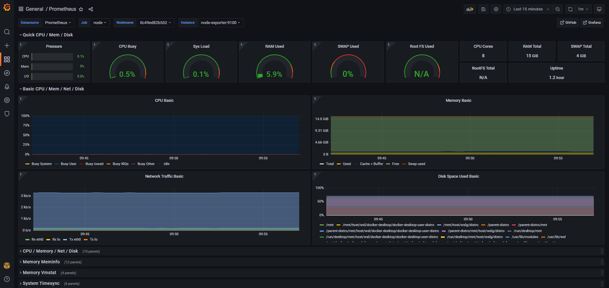
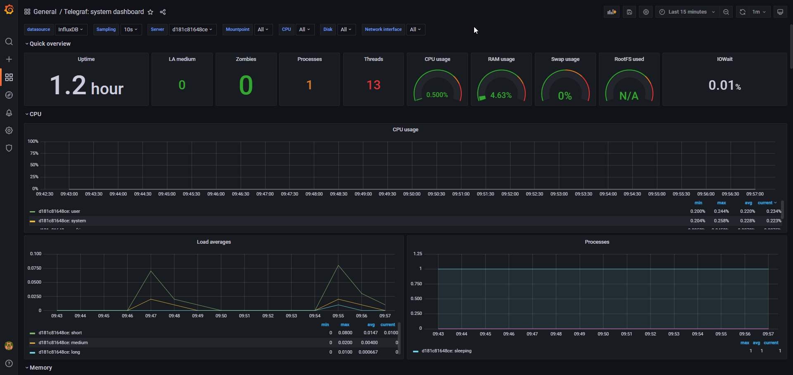

# Настройка окружения мониторинга ресурсов системы

В рамках работы настроен сбор и визуализация аппаратных метрик с использованием двух стеков: Prometheus и Telegraf.

## Выполненные настройки
1. **Стек Prometheus**:
   - Сбор метрик через `node-exporter`.
   - Интервал опроса (scrape_interval) изменен на **36 секунд**.
   - Визуализация: дашборд ID 1860.

2. **Стек Telegraf + InfluxDB**:
   - Настроен сбор метрик: CPU, RAM, Swap, Disk I/O и Network.
   - Интервал сбора данных (interval) изменен на **60 секунд**.
   - Визуализация: дашборд ID 928.

## Мониторинг
Для проверки стабильности работы системы был зафиксирован период в 15 минут в состоянии покоя. 

### Скриншоты панелей:
* **Prometheus Dashboard:** 
* **Telegraf Dashboard:** 
